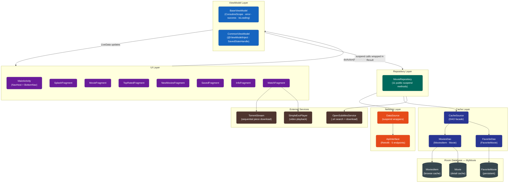
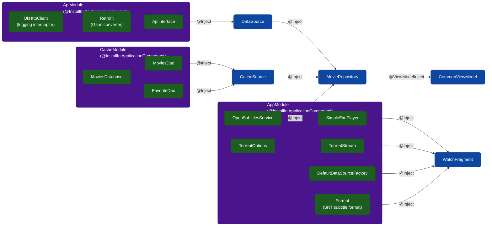
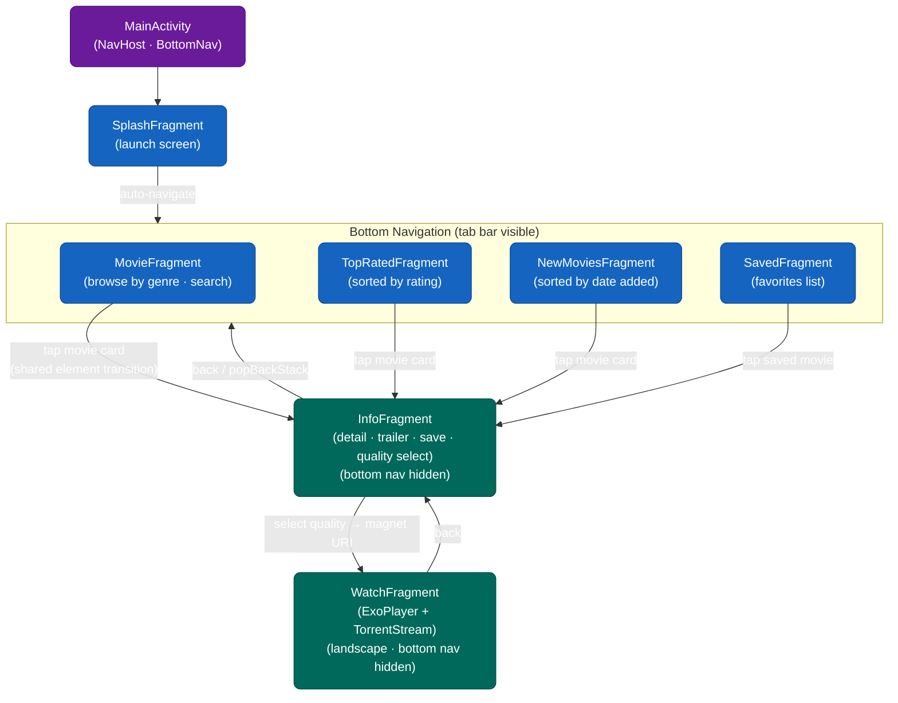
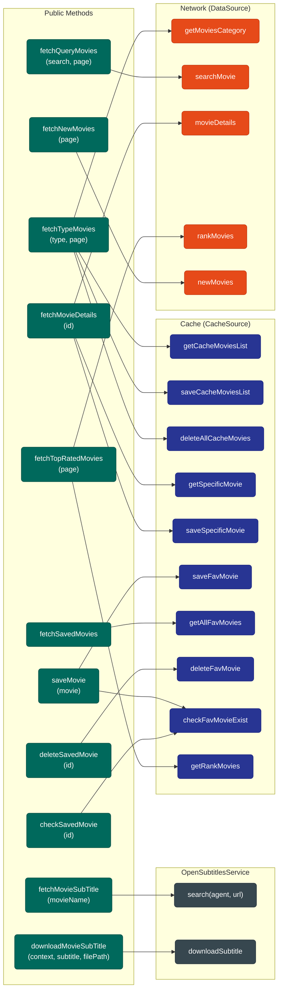
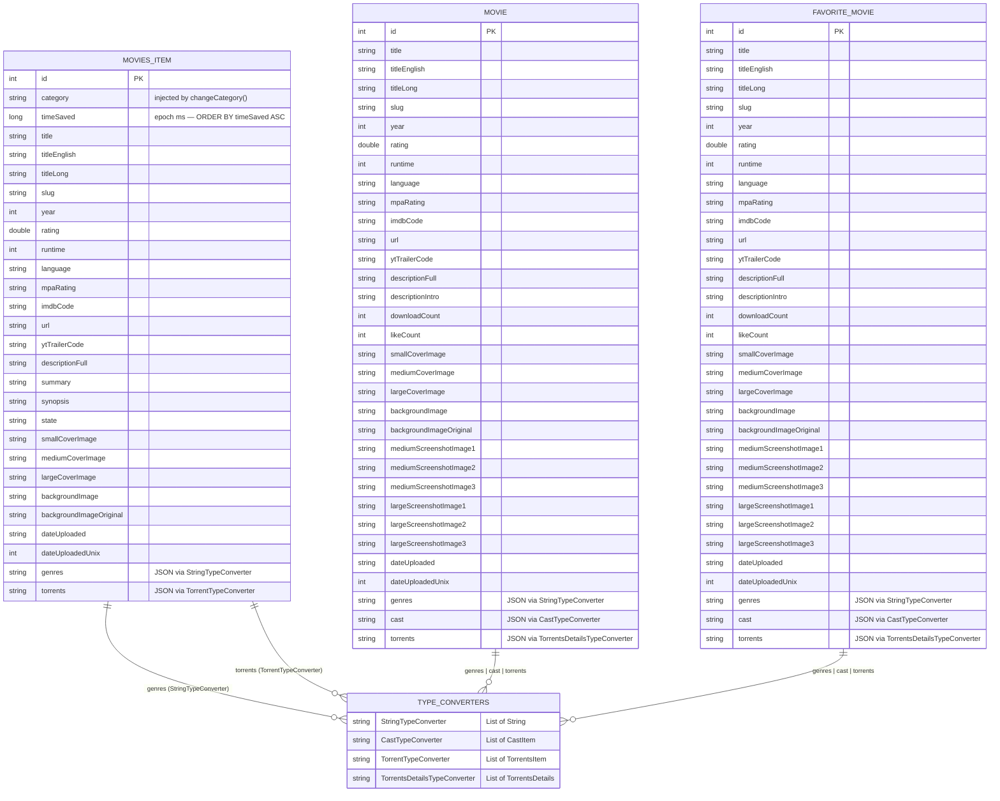
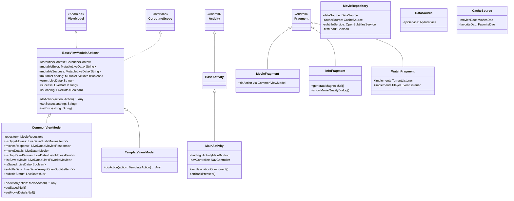
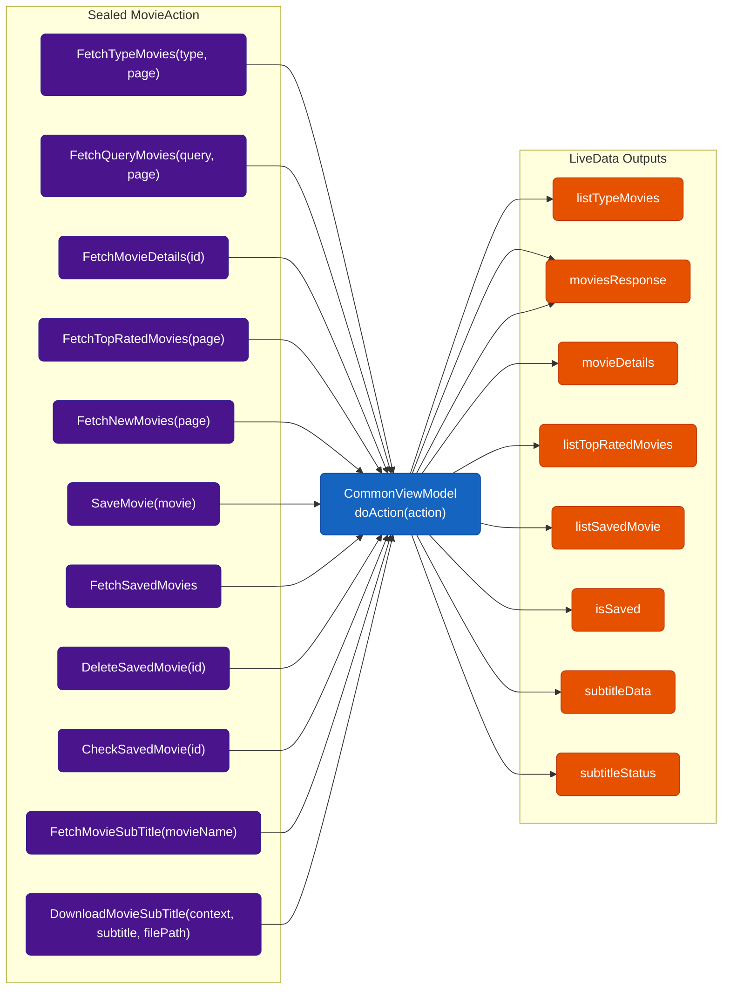
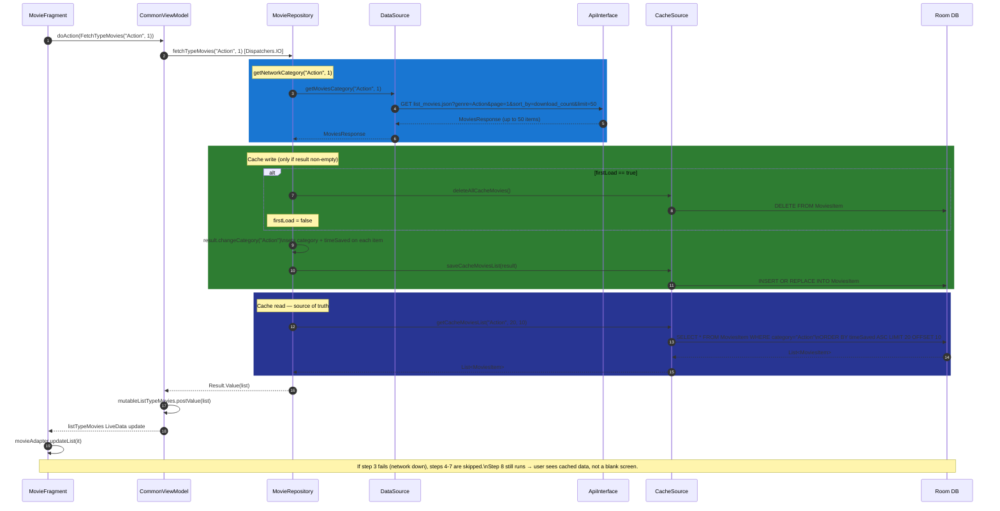
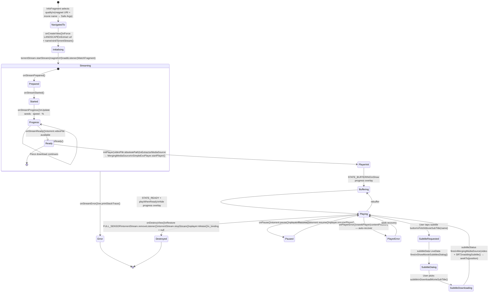

# MyMovies


**MyMovies** is a Kotlin Android client for discovering, streaming, and downloading movies from a third-party movie catalog API. It includes local subtitle search via OpenSubtitles, an offline favorites and browse cache backed by Room, and BitTorrent-based playback via ExoPlayer and TorrentStream, all wired through a single-Activity, Hilt-driven MVVM pipeline.

Where a naive implementation would bolt a `RecyclerView` directly onto a Retrofit callback, this app treats the network response as *disposable* and the local Room cache as the *source of truth* for what the UI renders. Network calls exist to refill the cache, not to feed the screen directly. That single decision is the spine the rest of this document explains.

---

## Table of Contents

1. [Problem Space](#1-problem-space)
2. [System Architecture](#2-system-architecture)
3. [Design Decisions & Rationale](#3-design-decisions--rationale)
   - [3.1 Cache-as-Source-of-Truth, Not Cache-as-Optimization](#31-cache-as-source-of-truth-not-cache-as-optimization)
   - [3.2 The `Result<T>` Sealed Wrapper](#32-the-resultt-sealed-wrapper)
   - [3.3 Torrent Playback: Magnet URI to ExoPlayer Frame](#33-torrent-playback-magnet-uri-to-exoplayer-frame)
   - [3.4 Subtitle Retrieval as a Second, Independent Client](#34-subtitle-retrieval-as-a-second-independent-client)
   - [3.5 Single-Activity Navigation](#35-single-activity-navigation)
4. [Module & File Reference](#4-module--file-reference)
   - [4.1 api](#41-api)
   - [4.2 cache](#42-cache)
   - [4.3 di](#43-di)
   - [4.4 models](#44-models)
   - [4.5 repository](#45-repository)
   - [4.6 utils](#46-utils)
   - [4.7 viewmodels](#47-viewmodels)
   - [4.8 views](#48-views)
5. [Data Models](#5-data-models)
6. [API Contract](#6-api-contract)
7. [Database Schema](#7-database-schema)
8. [ViewModel & Action System](#8-viewmodel--action-system)
9. [Data Flow: A Concrete Trace](#9-data-flow-a-concrete-trace)
10. [Tech Stack](#10-tech-stack)
11. [Build Configuration](#11-build-configuration)
12. [Known Rough Edges & Roadmap](#12-known-rough-edges--roadmap)
13. [Getting Started](#13-getting-started)
14. [Community & Project Health](#14-community--project-health)

---

## 1. Problem Space

A movie catalog/torrent client has three properties that make "just call the API and bind a RecyclerView" the wrong architecture from the outset:

1. **The upstream API is a public, rate-limited, occasionally-flaky third-party service** (a JSON movie catalog API; see [`Routes.kt`](app/src/main/java/com/example/mymovies/api/Routes.kt)). Every screen that hits it directly inherits its latency and its outages.
2. **Playback is not "download then play."** A magnet link has no bytes at request time; ExoPlayer needs a readable file or stream, and TorrentStream needs to sequentially fetch and expose pieces as a `File` while the swarm is still filling in. The app has to bridge a torrent session and a media player without blocking the UI thread on either.
3. **Subtitles are sourced from a *different* provider than the video** (OpenSubtitles, via a bespoke `OpenSubtitlesService`, not the movie API), so the subtitle fetch is architecturally a second, parallel repository dependency, not a field on the movie response.

Every top-level decision in this codebase, the Room cache boundary, the `Result<T>` wrapper, the `DataSource`/`CacheSource` split, the `MovieRepository` fan-out, exists to answer one of those three problems without leaking their complexity into the Fragment layer.

---

## 2. System Architecture

The entire app is structured in four strict layers. Data only moves upward through `LiveData`; commands only move downward through `MovieAction`.



---


**DI backbone:** [`AppModule`](app/src/main/java/com/example/mymovies/di/AppModule.kt) (app-level singletons: `SimpleExoPlayer`, `TorrentStream`, `DefaultDataSourceFactory`, `OpenSubtitlesService`, subtitle `Format`), [`ApiModule`](app/src/main/java/com/example/mymovies/api/ApiModule.kt) (OkHttp client with logging interceptor, Retrofit, `ApiInterface`), and [`CacheModule`](app/src/main/java/com/example/mymovies/cache/CacheModule.kt) (`MoviesDao`, `FavoriteDao`) hand fully-constructed dependencies to `MovieRepository` via constructor injection. The repository never knows how any of these are built, only that it receives a `DataSource`, `CacheSource`, and `OpenSubtitlesService`.


#### Dependency Injection Graph

Three Hilt modules provide every singleton in the app. Arrows show what is injected into what.



---
`

---

## 3. Design Decisions & Rationale

### 3.1 Cache-as-Source-of-Truth, Not Cache-as-Optimization

The naive pattern, where a network call fills a list and that list renders directly, is absent here on purpose. Look at [`fetchTypeMovies`](app/src/main/java/com/example/mymovies/repository/MovieRepository.kt):

```kotlin
suspend fun fetchTypeMovies(type: String, page: Int): Result<List<MoviesItem>> = try {
    getNetworkCategory(type, page)                                          // 1. refill cache from network
    val result = cacheSource.getCacheMoviesList(type, 20, page.times(10))  // 2. read from Room
    if (result.isEmpty()) throw IllegalArgumentException()
    Result.build { result }
} catch (e: Exception) {
    throw e
}
```

The Fragment never sees the network response shape directly for the browse lists. It sees whatever Room hands back, paginated with `limit`/`offset` semantics (`20, page.times(10)`) that are *independent* of whatever page size the upstream API happens to return. This buys three things simultaneously:

- **Decoupling of UI pagination from API pagination.** If the API changes its page size, `MoviesDao` pagination is untouched.
- **A natural stale-cache invalidation point.** `deleteLastCache()` clears the entire `MoviesItem` table exactly once per cold app session (guarded by the `firstLoad` companion flag) before the first category fetch. Subsequent category switches accumulate in the same table without wiping each other, while still guaranteeing a clean slate per session.
- **Graceful degradation.** `fetchTopRatedMovies` explicitly falls back to `getCacheRanking(page)` when the live network result is empty, keeping the UI on the last known-good ranking instead of showing an empty state. The network being unreachable and the network returning zero results are treated as the same recoverable condition.

`checkFavMovieExist` after every `saveMovie` is the same instinct applied to writes: don't trust that a write succeeded. Re-read from the same source the UI will next query, so the "saved" state the UI reflects is always what Room actually has, not what the app hoped it wrote.

**`fetchMovieDetails` has its own cache path:**

```kotlin
suspend fun fetchMovieDetails(id: Int): Result<Movie> = try {
    var result: Movie? = cacheSource.getSpecificMovie(id)  // 1. check Room first
    if (result == null) result = getNetworkDetails(id)     // 2. fallback to network + save
    Result.build { result }
} catch (e: Exception) {
    throw e
}
```

Detail pages are cached individually in the `Movie` table. If a user has previously opened a movie's detail page, re-opening it costs zero network requests.

### 3.2 The `Result<T>` Sealed Wrapper

[`Result`](app/src/main/java/com/example/mymovies/models/Result.kt) is a sealed class with five variants:

```kotlin
sealed class Result<out V> {
    class Loading<out V> : Result<V>()
    data class Success<out V>(val data: V) : Result<V>()
    data class Failure<out V>(val throwable: Throwable) : Result<V>()
    data class Value<out V>(val value: V) : Result<V>()
    data class Error(val exception: Exception) : Result<Nothing>()

    companion object {
        inline fun <V> build(function: () -> V): Result<V> = try {
            Value(function.invoke())
        } catch (e: Exception) {
            Error(e)
        }
    }
}
```

Every repository method returns `Result<T>`, not `T` and not a raw exception. This is the standard "don't let `try/catch` sprawl into the ViewModel" pattern, but it is worth being explicit about *why* it is non-negotiable here specifically: `MovieRepository` fans out to three independently-failing systems (movie catalog HTTP API, Room, OpenSubtitles HTTP API). Without a uniform result type, `CommonViewModel` would need three different failure-handling code paths instead of one. `Result.build { }` centralizes the success path; the `catch` blocks re-throw rather than swallow, which pushes the *decision* of what a failure means (empty state vs. retry vs. cached fallback) up to the repository method itself, which has enough context (which source failed, whether a fallback exists) to make that decision correctly.

In practice, `CommonViewModel` unwraps only the `Result.Value` branch:

```kotlin
is MovieAction.FetchTypeMovies -> fetchTypeMovies(action.type, action.page)
// ...
is Result.Value -> mutableListTypeMovies.postValue(result.value!!)
```

The `Loading`, `Success`, `Failure`, and `Error` variants are available for future use.

### 3.3 Torrent Playback: Magnet URI to ExoPlayer Frame

[`WatchFragment`](app/src/main/java/com/example/mymovies/views/fragments/WatchFragment.kt) is the most operationally interesting piece of this codebase, bridging two systems that were never designed to talk to each other:

- **TorrentStream** operates on *pieces*: it downloads a torrent's data sequentially (prioritizing the pieces needed for playback first) and exposes `TorrentListener` callbacks: `onStreamPrepared`, `onStreamStarted`, `onStreamReady`, `onStreamProgress`, `onStreamError`, `onStreamStopped`.
- **ExoPlayer** operates on *files/streams*: it expects something it can seek and read, not a piece-completion callback.

The bridge is: TorrentStream is pointed at a magnet URI (`generateMagneticUrl` in `InfoFragment` constructs it from the torrent hash, movie name, and year, appending eight tracker URLs). Once `onStreamReady` fires, `torrent?.videoFile?.absolutePath` is passed to ExoPlayer as a local file `Uri` via `ExtractorMediaSource`. The player starts consuming a file that TorrentStream is still writing to.

`TorrentOptions` are configured in `AppModule`:

```kotlin
TorrentOptions.Builder()
    .removeFilesAfterStop(true)
    .saveLocation(Environment.getExternalStoragePublicDirectory(Environment.DIRECTORY_DOWNLOADS))
    .build()
```

`removeFilesAfterStop(true)` ensures the local file is cleaned up when the stream stops, so the Downloads folder does not accumulate partially-downloaded videos.

Subtitles are merged into the player using `MergingMediaSource`:

```kotlin
// Without subtitle:
mergeMediaSource = MergingMediaSource(mediaSource)

// After subtitle download:
val textMediaSource = SingleSampleMediaSource.Factory(factory)
    .createMediaSource(data, format, C.TIME_UNSET)
mergeMediaSource = MergingMediaSource(mediaSource, textMediaSource)
simplePlayer.addingSubtitle(mergeMediaSource, simplePlayer.currentPosition)
```

`WatchFragment` forces landscape orientation on creation and restores `SCREEN_ORIENTATION_FULL_SENSOR` on destroy. The player hides/shows system UI in response to ExoPlayer's controller visibility, using `SYSTEM_UI_FLAG_IMMERSIVE`.

On `onPause`, both the torrent session and the player are suspended. On `onResume`, both are resumed. On `onDestroyView`, the torrent stream is stopped, the listener is removed, and the player is released.

### 3.4 Subtitle Retrieval as a Second, Independent Client

How subtitle search, download, and player merge works end-to-end inside `WatchFragment`.

```mermaid
sequenceDiagram
    autonumber
    participant WF as WatchFragment
    participant CV as CommonViewModel
    participant MR as MovieRepository
    participant OSS as OpenSubtitlesService
    participant EXT as External Files Dir

    note over WF: User taps subtitle button during playback
    WF->>WF: simplePlayer.stopPlayer()
    WF->>CV: doAction(FetchMovieSubTitle(movieName))

    rect rgb(78, 52, 46)
        note over CV,OSS: OpenSubtitles search
        CV->>MR: fetchMovieSubTitle(agent, url)
        note over CV: url = OpenSubtitlesUrlBuilder()\n.query(movieName).build()
        MR->>OSS: search(TemporaryUserAgent, url)
        OSS-->>MR: Array<OpenSubtitleItem>
        MR-->>CV: Result.Value(subtitles)
    end

    CV->>CV: mutableSubtitleData.postValue(subtitles)
    CV-->>WF: subtitleData LiveData fires

    WF->>WF: showMovieSubtitlesDialog(subtitles)\nItemSubtitleAdapter in AlertDialog

    note over WF: User selects a subtitle from the list

    rect rgb(40, 53, 147)
        WF->>CV: doAction(DownloadMovieSubTitle(context,\nsubtitle,\nUri.fromFile(externalFilesDir/SubFileName)))
        CV->>MR: downloadMovieSubTitle(context, subtitle, filePath)
        MR->>OSS: downloadSubtitle(context, subtitle, filePath)
        OSS-->>EXT: writes .srt file to externalFilesDir
        MR-->>CV: Result.Value("Success")
        CV->>CV: mutableSubtitleStatus.postValue(filePath)
        CV-->>WF: subtitleStatus LiveData fires
    end

    WF->>WF: alertDialog.dismiss()
    WF->>WF: addSubtitleToPlayer(filePath)
    note over WF: SingleSampleMediaSource.Factory(factory)\n.createMediaSource(filePath, SRT_format, TIME_UNSET)
    WF->>WF: MergingMediaSource(videoSource, textSource)
    WF->>WF: simplePlayer.addingSubtitle(merged, currentPosition)
    note over WF: Player resumes at the same position\nwith the subtitle track now active
```



---

`fetchMovieSubTitle` and `downloadMovieSubTitle` sit on `MovieRepository` next to the movie-catalog methods, but they talk to a completely different backend (`OpenSubtitlesService`) with a completely different contract:

```kotlin
// Search
subtitleService.search(OpenSubtitlesService.TemporaryUserAgent, url)
// url is built by:
OpenSubtitlesUrlBuilder().query(movieName).build()

// Download
subtitleService.downloadSubtitle(context, subtitle, filePath)
// filePath is:
Uri.fromFile(File("${activity?.getExternalFilesDir(null)?.absolutePath}/${subtitle.SubFileName}"))
```

The result is an `Array<OpenSubtitleItem>` displayed in a dialog inside `WatchFragment`. Selecting a subtitle triggers `DownloadMovieSubTitle`, which saves the `.srt` file to the app's external files directory and then merges it into the `MergingMediaSource`.

Keeping this on the *same* repository (rather than a `SubtitleRepository`) was a deliberate simplification: from the ViewModel's perspective, "get me artifacts related to this movie" is one concern. The seam is at the DI boundary (`OpenSubtitlesService` is its own Hilt-provided singleton in `AppModule`), so the subtitle provider can be swapped without touching any other code.

### 3.5 Single-Activity Navigation

The app has a single `Activity` and all screens are `Fragment`s managed by the Navigation Component.



---

`MainActivity` is the only entry point declared in [`AndroidManifest.xml`](app/src/main/AndroidManifest.xml). Everything else is a Fragment transaction managed by the Navigation Component.

The bottom navigation bar is shown/hidden reactively based on destination:

```kotlin
when (destination.id) {
    R.id.splashFragment, R.id.watchFragment, R.id.infoFragment -> binding.bottomNav.toGone()
    else -> binding.bottomNav.toVisible()
}
```

Back-press is intercepted for `MovieFragment` (scrolls to top if the list position is past 10 rather than exiting) and `InfoFragment` (collapses YouTube fullscreen if active before popping the back stack).

`InfoFragment` uses a shared element transition (`android.R.transition.move`) on the movie cover image, with `transitionName = "transition"` coordinated between the adapter and the Fragment.

`BaseActivity` and `BaseViewModel` exist to hoist the things every screen needs, specifically `error`, `success`, and `isLoading` `LiveData` fields, plus the `doAction(action: Action)` contract that `CommonViewModel` implements.

---

## 4. Module & File Reference

### 4.1 api

| File | Role |
|---|---|
| [`ApiInterface.kt`](app/src/main/java/com/example/mymovies/api/ApiInterface.kt) | Retrofit interface: `searchMovie`, `getMoviesByCategory`, `getMovieDetails`, `getMoviesByRank`, `getMoviesByDate` |
| [`ApiModule.kt`](app/src/main/java/com/example/mymovies/api/ApiModule.kt) | Hilt module providing OkHttp (logging interceptor), Retrofit, and `ApiInterface` |
| [`DataSource.kt`](app/src/main/java/com/example/mymovies/api/DataSource.kt) | Thin `@Inject` wrapper over `ApiInterface`; exposes `suspend` methods consumed by `MovieRepository` |
| [`Routes.kt`](app/src/main/java/com/example/mymovies/api/Routes.kt) | Endpoint path constants: `LIST_MOVIES`, `MOVIE_DETAILS`, `MOVIE_SUGGESTIONS`, `MOVIE_COMMENTS`, `MOVIE_REVIEW`, `MOVIE_PARENTAL_GUIDE`, `UPCOMING_MOVIES`, `USER_DETAILS` |

### 4.2 cache

| File | Role |
|---|---|
| [`MoviesDatabase.kt`](app/src/main/java/com/example/mymovies/cache/MoviesDatabase.kt) | Room database, version 1, entities: `MoviesItem`, `Movie`, `FavoriteMovie`; type converters: `StringTypeConverter`, `CastTypeConverter`, `TorrentTypeConverter`, `TorrentsDetailsTypeConverter` |
| [`MoviesDao.kt`](app/src/main/java/com/example/mymovies/cache/MoviesDao.kt) | DAO for `MoviesItem` and `Movie`: `saveMovies`, `getAllMovies` (by category, `LIMIT`/`OFFSET`), `deleteMoviesList`, `saveSpecificMovie`, `getSpecificMovie`, `getTopRankMovies` |
| [`FavoriteDao.kt`](app/src/main/java/com/example/mymovies/cache/FavoriteDao.kt) | DAO for `FavoriteMovie`: `saveFavoriteMovie`, `getAllFavMovies`, `deleteFavMovie`, `checkMovieExist` |
| [`CacheSource.kt`](app/src/main/java/com/example/mymovies/cache/CacheSource.kt) | `@Inject` facade over `MoviesDao` and `FavoriteDao`; consumed by `MovieRepository` |
| [`CacheModule.kt`](app/src/main/java/com/example/mymovies/cache/CacheModule.kt) | Hilt module providing `MoviesDatabase` and both DAOs |

### 4.3 di

| File | Role |
|---|---|
| [`AppModule.kt`](app/src/main/java/com/example/mymovies/di/AppModule.kt) | App-scoped singletons: `OpenSubtitlesService`, `SimpleExoPlayer`, `DefaultDataSourceFactory`, `TorrentOptions`, `TorrentStream`, subtitle `Format` (SRT/SubRip, `MimeTypes.APPLICATION_SUBRIP`, English) |

### 4.4 models

| File | Role |
|---|---|
| [`Result.kt`](app/src/main/java/com/example/mymovies/models/Result.kt) | Sealed wrapper: `Loading`, `Success`, `Failure`, `Value`, `Error`, `Result.build {}` factory |
| [`MovieDetails.kt`](app/src/main/java/com/example/mymovies/models/MovieDetails.kt) | API response wrapper for detail endpoint; contains `Movie` (Room `@Entity`), `CastItem`, `TorrentsDetails`, `DataDetails`, `MetaDetails` |
| [`FavoriteMovie.kt`](app/src/main/java/com/example/mymovies/models/FavoriteMovie.kt) | Room `@Entity` for persisted favorites; populated via `Movie.convertToFavorite()` extension |
| [`TypeConverters.kt`](app/src/main/java/com/example/mymovies/models/TypeConverters.kt) | Room type converters: `StringTypeConverter` (genre list), `CastTypeConverter` (`List<CastItem>`), `TorrentTypeConverter` (`List<TorrentsItem>`), `TorrentsDetailsTypeConverter` (`List<TorrentsDetails>`) |
| [`response/MoviesResponse.kt`](app/src/main/java/com/example/mymovies/models/response/MoviesResponse.kt) | API response envelope for list endpoints; contains `MoviesItem` (Room `@Entity`), `TorrentsItem`, `Data`, `Meta` |

### 4.5 repository

Every public method on `MovieRepository`, what it calls, and what it returns.



---

| File | Role |
|---|---|
| [`MovieRepository.kt`](app/src/main/java/com/example/mymovies/repository/MovieRepository.kt) | Single fan-out point: 11 public `suspend` methods, 3 private helpers (`getNetworkCategory`, `getNetworkDetails`, `deleteLastCache`, `getCacheRanking`, `checkFavMovieExist`), `firstLoad` companion flag |

### 4.6 utils

| File | Role |
|---|---|
| [`UtilTypeConverter.kt`](app/src/main/java/com/example/mymovies/utils/UtilTypeConverter.kt) | Extension functions: `View.show/gone/invisible`, `Activity.hideBottomNav/showBottomNav`, `SimpleExoPlayer.startPlayer/stopPlayer/resumePlayer/seekPlayer/addingSubtitle`, `ImageView.downloadImage` (Picasso), `TextView.formatText/textOrGone/addCategories`, `List<MoviesItem>.changeCategory`, `Movie.convertToFavorite`, `MutableList<MoviesItem>.distinctList/addList`, `RecyclerView.addDividers`, `Fragment.hideSystemUI/showSystemUI` |
| [`ViewUtil.kt`](app/src/main/java/com/example/mymovies/utils/ViewUtil.kt) | Additional view utilities |
| [`constants/Constants.kt`](app/src/main/java/com/example/mymovies/utils/constants/Constants.kt) | `BASE_URL`, `DB_NAME` ("MyMovie"), `YOUTUBE_API_KEY`, `typeList` (16 genre strings: all, Comedy, Sci-Fi, Horror, Romance, Action, Thriller, Drama, Mystery, Crime, Animation, Adventure, Fantasy, Comedy-Romance, Action-Comedy, Superhero) |

### 4.7 viewmodels

| File | Role |
|---|---|
| [`BaseViewModel.kt`](app/src/main/java/com/example/mymovies/viewmodels/BaseViewModel.kt) | Abstract `ViewModel` + `CoroutineScope` on `Dispatchers.IO`; exposes `error`, `success`, `isLoading` `LiveData`; declares `doAction(action: Action)` |
| [`CommonViewModel.kt`](app/src/main/java/com/example/mymovies/viewmodels/CommonViewModel.kt) | `@ViewModelInject`, `SavedStateHandle`; exposes: `listTypeMovies`, `moviesResponse`, `movieDetails`, `listTopRatedMovies`, `listSavedMovie`, `isSaved`, `subtitleData`, `subtitleStatus`; dispatches all 11 `MovieAction` variants; `setSavedNull()`, `setMovieDetailsNull()` reset helpers |
| [`TemplateViewModel.kt`](app/src/main/java/com/example/mymovies/viewmodels/TemplateViewModel.kt) | Scaffold for new screens |
| [`actions/MovieAction.kt`](app/src/main/java/com/example/mymovies/viewmodels/actions/MovieAction.kt) | Sealed action class with 11 variants (see §8) |

### 4.8 views

**Activities**

| File | Role |
|---|---|
| [`BaseActivity.kt`](app/src/main/java/com/example/mymovies/views/activities/BaseActivity.kt) | Base activity stub |
| [`MainActivity.kt`](app/src/main/java/com/example/mymovies/views/activities/MainActivity.kt) | `@AndroidEntryPoint`; hosts `NavHostFragment`; wires bottom navigation; hides bottom nav on Splash/Watch/Info; intercepts back-press for `MovieFragment` and `InfoFragment` |

**Fragments**

| File | Screen | Key Responsibilities |
|---|---|---|
| [`SplashFragment`](app/src/main/java/com/example/mymovies/views/fragments/SplashFragment.kt) | Launch screen | Initial splash before navigating to `MovieFragment` |
| [`MovieFragment`](app/src/main/java/com/example/mymovies/views/fragments/MovieFragment.kt) | Browse by genre | Horizontal genre chip list (`ItemMovieTypeAdapter`), paginated movie grid (`ItemMovieAdapter`), toolbar search via `SearchView`, pull-to-refresh, shared element transition to `InfoFragment`, back-press scroll-to-top |
| [`TopRatedFragment`](app/src/main/java/com/example/mymovies/views/fragments/TopRatedFragment.kt) | Top-rated movies | Sorted by rating descending, Room fallback on network failure |
| [`NewMoviesFragment`](app/src/main/java/com/example/mymovies/views/fragments/NewMoviesFragment.kt) | Recently added | Sorted by date added descending; currently bypasses Room round-trip (see Roadmap) |
| [`SavedFragment`](app/src/main/java/com/example/mymovies/views/fragments/SavedFragment.kt) | Favorites list | Reads `FavoriteMovie` table via `fetchSavedMovies`; `ItemSavedAdapter` |
| [`InfoFragment`](app/src/main/java/com/example/mymovies/views/fragments/InfoFragment.kt) | Movie detail | Movie cover, background, title, genres, MPA rating, description, rating, cast recycler, screenshot recycler; YouTube trailer (YouTubePlayerSupportFragmentX); quality selection dialog; save/delete favorite; `generateMagneticUrl` builds magnet link with 8 trackers; shared element enter transition |
| [`WatchFragment`](app/src/main/java/com/example/mymovies/views/fragments/WatchFragment.kt) | Playback | TorrentListener + Player.EventListener + ListenerSubtitle; landscape forced; stream progress overlay (seeds, speed, %); subtitle search dialog; subtitle download + merge into player; pause/resume lifecycle hooks |
| [`TemplateFragment`](app/src/main/java/com/example/mymovies/views/fragments/TemplateFragment.kt) | New screen scaffold | Empty template |

**Adapters**

| Adapter | Used By | Purpose |
|---|---|---|
| `ItemMovieAdapter` | `MovieFragment` | Main browse grid; opens `InfoFragment` with shared element transition |
| `ItemMovieTypeAdapter` | `MovieFragment` | Horizontal genre chip selector; emits `selectedIndex` as `LiveData<String>` |
| `ItemTopRatedAdapter` | `TopRatedFragment` | Top-rated list items |
| `ItemSavedAdapter` | `SavedFragment` | Saved/favorite movie list |
| `ItemCastAdapter` | `InfoFragment` | Horizontal cast photo strip |
| `ItemScreenShotAdapter` | `InfoFragment` | Horizontal screenshot strip |
| `ItemSubtitleAdapter` | `WatchFragment` | Subtitle search results dialog |
| `ItemQualityAdapter` | `InfoFragment`, `WatchFragment` | Quality/torrent selection dialog |
| `TemplateAdapter` | Scaffold | Empty template |

---

## 5. Data Models

### Movie (full detail, Room entity)

Fields persisted to the `movie` table:

`id` (PK), `title`, `titleEnglish`, `titleLong`, `slug`, `year`, `rating`, `runtime`, `language`, `mpaRating`, `imdbCode`, `descriptionFull`, `descriptionIntro`, `summary`, `url`, `ytTrailerCode`, `smallCoverImage`, `mediumCoverImage`, `largeCoverImage`, `backgroundImage`, `backgroundImageOriginal`, `smallCoverImage`, `mediumScreenshotImage1/2/3`, `largeScreenshotImage1/2/3`, `downloadCount`, `likeCount`, `dateUploaded`, `dateUploadedUnix`, `genres` (List, TypeConverter), `cast` (List\<CastItem\>, TypeConverter), `torrents` (List\<TorrentsDetails\>, TypeConverter)

### MoviesItem (browse cache, Room entity)

Subset of `Movie` fields used for list display, stored in the `MoviesItem` table:

`id` (PK), `title`, `titleEnglish`, `titleLong`, `slug`, `year`, `rating`, `runtime`, `language`, `mpaRating`, `imdbCode`, `descriptionFull`, `summary`, `url`, `ytTrailerCode`, `smallCoverImage`, `mediumCoverImage`, `largeCoverImage`, `backgroundImage`, `backgroundImageOriginal`, `dateUploaded`, `dateUploadedUnix`, `genres` (TypeConverter), `torrents` (List\<TorrentsItem\>, TypeConverter), `category` (injected by `changeCategory()`), `timeSaved` (epoch ms, injected by `changeCategory()`, used for `ORDER BY timeSaved ASC`)

### FavoriteMovie (Room entity)

Fields: same as `Movie` minus fields not needed for the saved list; includes `cast`, `torrents`, all screenshot URLs, `downloadCount`, `likeCount`. Populated via `Movie.convertToFavorite()`.

### CastItem

`name`, `characterName`, `urlSmallImage`, `imdbCode`

### TorrentsDetails / TorrentsItem

`hash`, `quality`, `type`, `url`, `size`, `sizeBytes`, `seeds`, `peers`, `dateUploaded`, `dateUploadedUnix`

The `hash` from `TorrentsDetails` is used by `InfoFragment.generateMagneticUrl()` to construct the magnet URI passed to `WatchFragment`.

---

## 6. API Contract

Base URL is set in [`Constants.kt`](app/src/main/java/com/example/mymovies/utils/constants/Constants.kt).

All endpoints are defined as path constants in [`Routes.kt`](app/src/main/java/com/example/mymovies/api/Routes.kt):

| Constant | Path | Notes |
|---|---|---|
| `LIST_MOVIES` | `list_movies.json` | Used for category, search, rank, and new-movies queries |
| `MOVIE_DETAILS` | `movie_details.json` | Fetches full `Movie` with images and cast |
| `MOVIE_SUGGESTIONS` | `movie_suggestions.json` | Defined but not yet wired to a UI path |
| `MOVIE_COMMENTS` | `movie_comments.json` | Defined but not yet wired |
| `MOVIE_REVIEW` | `movie_reviews.json` | Defined but not yet wired |
| `MOVIE_PARENTAL_GUIDE` | `movie_parental_guides.json` | Defined but not yet wired |
| `UPCOMING_MOVIES` | `list_upcoming.json` | Defined but not yet wired |
| `USER_DETAILS` | `user_details.json` | Defined but not yet wired |

**Active `ApiInterface` methods:**

| Method | Query params | Sort/filter baked in |
|---|---|---|
| `searchMovie(search, page)` | `query_term`, `page` | `sort_by=download_count`, `order_by=desc`, `limit=50` |
| `getMoviesByCategory(category, page)` | `genre`, `page` | `sort_by=download_count`, `order_by=desc`, `limit=50` |
| `getMovieDetails(id)` | `movie_id` | `with_images=true`, `with_cast=true`, `limit=50` |
| `getMoviesByRank(page)` | `page` | `sort_by=rating`, `limit=50` |
| `getMoviesByDate(page)` | `page` | `sort_by=date_added`, `order_by=desc`, `limit=50` |

---

## 7. Database Schema

Three Room entities in one database. `MoviesItem` and `Movie` are separate caches; `FavoriteMovie` is persistent.



---

**Database name:** `MyMovie` (from `Constants.DB_NAME`)
**Version:** 1, `exportSchema = false`

### Table: MoviesItem

| Column | Type | Notes |
|---|---|---|
| `id` | INTEGER | Primary key |
| `category` | TEXT | Injected by `changeCategory()` |
| `timeSaved` | INTEGER | Epoch ms, for `ORDER BY timeSaved ASC` |
| `title`, `titleEnglish`, `titleLong`, `slug` | TEXT | |
| `year`, `runtime`, `dateUploadedUnix` | INTEGER | |
| `rating` | REAL | |
| `language`, `mpaRating`, `imdbCode`, `url` | TEXT | |
| `descriptionFull`, `summary`, `synopsis` | TEXT | |
| `ytTrailerCode` | TEXT | |
| `smallCoverImage`, `mediumCoverImage`, `largeCoverImage` | TEXT | |
| `backgroundImage`, `backgroundImageOriginal` | TEXT | |
| `dateUploaded`, `state` | TEXT | |
| `genres` | TEXT | JSON-serialized `List<String>` via `StringTypeConverter` |
| `torrents` | TEXT | JSON-serialized `List<TorrentsItem>` via `TorrentTypeConverter` |

**Queries on `MoviesItem`:**

```sql
-- Browse (category + pagination)
SELECT * FROM MoviesItem WHERE category = :category ORDER BY timeSaved ASC LIMIT :limit OFFSET :page

-- Top-rated fallback
SELECT * FROM MoviesItem ORDER BY rating DESC LIMIT :limit OFFSET :page

-- Full clear (once per cold session)
DELETE FROM MoviesItem
```

### Table: Movie

Same columns as `MoviesItem` plus additional detail fields (screenshots, cast, download/like counts, intro description). Queried by `id` for the detail cache:

```sql
SELECT * FROM movie WHERE id = :id LIMIT 1
```

### Table: FavoriteMovie

Persistent favorites table. `REPLACE` on conflict (re-saving a favorite is idempotent). Supports:

```sql
SELECT * FROM FavoriteMovie
DELETE FROM FavoriteMovie WHERE id = :id
SELECT EXISTS(SELECT * FROM FavoriteMovie WHERE id = :id)  -- used for the heart icon state
```

---

## 8. ViewModel & Action System



---

`BaseViewModel<Action>` is a generic abstract ViewModel that also implements `CoroutineScope`, binding coroutines to `Dispatchers.IO` with a fresh `Job()`. Subclasses declare `doAction(action: Action)`.

`CommonViewModel` is the one ViewModel shared across all active Fragments via `ViewModelProvider(requireActivity())`. It dispatches `MovieAction` via `doAction()` and exposes results as `LiveData`.

### MovieAction sealed class

```kotlin
sealed class MovieAction {
    data class FetchTypeMovies(val type: String, val page: Int = 1) : MovieAction()
    data class FetchQueryMovies(val query: String, val page: Int) : MovieAction()
    data class FetchMovieDetails(val id: Int) : MovieAction()
    data class FetchTopRatedMovies(val page: Int) : MovieAction()
    data class FetchNewMovies(val page: Int) : MovieAction()
    data class SaveMovie(val movie: Movie) : MovieAction()
    object FetchSavedMovies : MovieAction()
    data class DeleteSavedMovie(val id: Int) : MovieAction()
    data class CheckSavedMovie(val id: Int) : MovieAction()
    data class FetchMovieSubTitle(val movieName: String) : MovieAction()
    data class DownloadMovieSubTitle(val context: Context, val subtitle: OpenSubtitleItem, val filePath: Uri) : MovieAction()
}
```

#### Action Dispatch Flow

How a UI event becomes a repository call and surfaces back as `LiveData`.



---

### LiveData outputs from CommonViewModel

| Property | Type | Source |
|---|---|---|
| `listTypeMovies` | `LiveData<List<MoviesItem>>` | `FetchTypeMovies` |
| `moviesResponse` | `LiveData<MoviesResponse>` | `FetchQueryMovies`, `FetchNewMovies` |
| `movieDetails` | `LiveData<Movie?>` | `FetchMovieDetails`; reset to `null` by `setMovieDetailsNull()` |
| `listTopRatedMovies` | `LiveData<List<MoviesItem>>` | `FetchTopRatedMovies` |
| `listSavedMovie` | `LiveData<List<FavoriteMovie>>` | `FetchSavedMovies` |
| `isSaved` | `LiveData<Boolean?>` | `CheckSavedMovie`; initialized to `null`; reset by `setSavedNull()` |
| `subtitleData` | `LiveData<Array<OpenSubtitleItem>>` | `FetchMovieSubTitle` |
| `subtitleStatus` | `LiveData<Uri>` | `DownloadMovieSubTitle` (fires the subtitle file path on success) |

---

## 9. Data Flow: A Concrete Trace

The canonical cache-as-source-of-truth pattern. The Fragment always reads from Room, never from the network response directly.



---

To make §3.1 concrete, here is what happens end to end when a user opens the "Action" category on `MovieFragment`:

1. `MovieFragment` observes `typeAdapter.selectedIndex`; when "Action" is selected, it calls `viewModel.doAction(MovieAction.FetchTypeMovies("Action", 1))`.
2. `CommonViewModel.doAction` dispatches to `fetchTypeMovies("Action", 1)`, which launches a coroutine on `Dispatchers.IO`.
3. `repository.fetchTypeMovies("Action", 1)` calls `getNetworkCategory("Action", 1)`:
   - `dataSource.getMoviesCategory("Action", 1)` hits `ApiInterface.getMoviesByCategory(genre="Action", page=1)` (URL: `list_movies.json?sort_by=download_count&order_by=desc&limit=50&genre=Action&page=1`).
   - On a non-empty result: if `firstLoad` is `true`, `cacheSource.deleteAllCacheMovies()` clears the entire `MoviesItem` table and sets `firstLoad = false`. Then `result.changeCategory("Action")` tags each item with `category = "Action"` and `timeSaved = System.currentTimeMillis()`, and `cacheSource.saveCacheMoviesList(result)` inserts via `MoviesDao.saveMovies()` with `OnConflictStrategy.REPLACE`.
4. The repository reads back through `cacheSource.getCacheMoviesList("Action", 20, 10)` (20 rows, offset `1.times(10) = 10`) and returns `Result.build { result }`.
5. `CommonViewModel` posts the list to `mutableListTypeMovies`.
6. `MovieFragment` observes the update, dismisses the pull-to-refresh spinner, hides the empty-state view, shows the RecyclerView, and calls `movieAdapter.updateList(it)`.
7. The user never knows a network call happened. If step 3 throws (network down), step 4 still runs against whatever was in Room from the previous successful load of "Action".

**Playback flow:**

`WatchFragment` implements `TorrentListener` and `Player.EventListener`. This diagram shows every state transition from navigation to teardown.



---

1. On `InfoFragment`, tapping the play FAB calls `showMovieQualityDialog`. The user selects a quality (e.g. `1080p`).
2. `generateMagneticUrl(hash, "MovieTitle (2021) 1080p")` constructs a magnet URI with 8 tracker announcements.
3. `InfoFragment` navigates to `WatchFragment` with the magnet URI and movie name as Safe Args.
4. `WatchFragment.onCreateView` forces landscape, extracts the URL and name, then `initTorrentStream()` calls `torrentStream.startStream(url)`.
5. `onStreamProgress` updates the seed count, download speed, and percentage overlays.
6. `onStreamReady` receives the `Torrent` object; `torrent?.videoFile?.absolutePath` is passed to `initPlayer(path)`, which creates an `ExtractorMediaSource` and hands it to `SimpleExoPlayer`.
7. `onPlayerStateChanged` hides the progress container when `STATE_READY` and shows it again on `STATE_BUFFERING`.
8. `onPlayerError` seeks to the last known position rather than crashing.

---

## 10. Tech Stack

| Concern | Library | Version | Notes |
|---|---|---|---|
| Language | Kotlin | (project `kotlin_version`) | |
| DI | Hilt | 2.28-alpha | `AppModule`, `ApiModule`, `CacheModule` |
| DI (ViewModel) | `hilt-lifecycle-viewmodel` | 1.0.0-alpha02 | `@ViewModelInject` + `@Assisted SavedStateHandle` |
| Async | Kotlin Coroutines | core 1.4.1, android 1.3.9, play-services 1.1.1 | `BaseViewModel` scope on `Dispatchers.IO` |
| HTTP | Retrofit2 | 2.9.0 | + Gson converter |
| HTTP logging | OkHttp logging interceptor | 4.8.1 | |
| Local DB | Room | 2.2.5 | 3 entities, 4 type converters |
| Navigation | Navigation Component | 2.3.3 | Safe Args plugin, single-Activity |
| Video | ExoPlayer | 2.9.6 | `SimpleExoPlayer`, `ExtractorMediaSource`, `MergingMediaSource`, `SingleSampleMediaSource` |
| Torrent | TorrentStream-Android | 2.7.0 | Sequential piece download, `TorrentListener` callbacks |
| Subtitles | open-subtitles-android | 0.0.8 | `OpenSubtitlesService`, `OpenSubtitlesUrlBuilder` |
| Image loading | Glide | 4.11.0 | Primary image loader |
| Image loading (legacy) | Picasso | 2.71828 | Used in `downloadImage` extension; being phased out |
| YouTube player | YouTubeAndroidPlayerApi | (local jar) | `YouTubePlayerSupportFragmentX`, trailers in `InfoFragment` |
| Permissions | Dexter | 6.0.1 | Runtime storage permissions |
| Biometric | `androidx.biometric-ktx` | 1.2.0-alpha02 | Optional biometric gate |
| Firebase | BOM 25.12.0 | | Crashlytics, Analytics |
| UI | Material Components | 1.3.0 | |
| UI | ConstraintLayout | 2.0.4 | |
| UI | CardView | 1.0.0 | |
| UI | RecyclerView | 1.1.0 | |
| UI | Transition-ktx | 1.4.0 | Shared element transitions |
| UI | CircleImageView | 3.1.0 | Cast photos |
| UI | android-gif-drawable | 1.2.19 | GIF support |
| UI | DiscreteScrollView | 1.5.1 | Snap-scroll list |
| UI | ViewBinding | enabled | `viewBinding = true` |
| DataStore | `datastore-preferences` | 1.0.0-alpha05 | Present in deps, not yet wired to a feature |
| MultiDex | `multidex` | 2.0.1 | `multiDexEnabled true` |
| Test | JUnit4, Espresso, AndroidX Test | standard | No tests implemented yet |

---

## 11. Build Configuration

```
applicationId    com.example.mymovies
versionCode      1
versionName      1.0
minSdkVersion    23   (Android 6.0 Marshmallow)
targetSdkVersion 30   (Android 11)
compileSdkVersion 30
buildToolsVersion 30.0.3
jvmTarget        1.8
```

Plugins applied: `kotlin-android`, `kotlin-kapt`, `com.google.gms.google-services`, `dagger.hilt.android.plugin`, `androidx.navigation.safeargs.kotlin`, `com.google.firebase.crashlytics`.

`minifyEnabled false` in the release build type; Proguard rules file is present but minification is not yet active.

`vectorDrawables.useSupportLibrary = true` for backward-compatible vector drawables.

Full dependency list: [`app/build.gradle`](app/build.gradle).

---

## 12. Known Rough Edges & Roadmap

- **`fetchNewMovies` skips the Room round-trip** that every other list method uses, returning the raw `MoviesResponse` from `DataSource` directly. Bringing it in line with `fetchTypeMovies`/`fetchTopRatedMovies` would give the "New" tab the same offline-fallback guarantee the rest of the app has.
- **Picasso and Glide are both present.** `downloadImage` in `UtilTypeConverter` still uses Picasso. Consolidate on Glide and remove the Picasso dependency.
- **No automated tests yet.** `MovieRepository`'s fallback branches (§3.1) and `Result.build` (§3.2) are the highest-value, most side-effect-isolated starting points for unit tests. The Espresso and JUnit dependencies are already declared.
- **Torrent piece-priority tuning.** Sequential download is functionally correct but not adaptive to playback position. Re-prioritizing pieces on user seek would improve scrubbing UX.
- **Extract subtitle logic into its own repository** once it grows past "search + download" (e.g. auto-sync, offset correction), to keep `MovieRepository` focused on the movie-catalog concern.
- **Formalize cache invalidation beyond `firstLoad`.** A TTL or explicit pull-to-refresh signal would remove the "once per cold start" assumption baked into `deleteLastCache()`.
- **Several `Routes.kt` constants are unused in the UI.** `MOVIE_SUGGESTIONS`, `MOVIE_COMMENTS`, `MOVIE_REVIEW`, `MOVIE_PARENTAL_GUIDE`, `UPCOMING_MOVIES`, and `USER_DETAILS` are defined but no `ApiInterface` methods use them yet.
- **DataStore is a declared dependency** (`datastore-preferences`) but is not wired to any feature. A natural use would be persisting user preferences (default genre, biometric toggle state).
- **Release build has minification disabled.** Enable `minifyEnabled true` with proper Proguard/R8 rules for a production release.
- **`movieID = 0` default in `InfoFragment`.** If navigation arguments are misconfigured, the fragment silently fetches movie ID 0 rather than failing fast.
- **`showToast` debug calls remain in production code** in `InfoFragment` (trailer code toast) and `WatchFragment` (URL toast). These should be removed before a production release.

---
## 13. Getting Started

```bash
git clone https://github.com/PRADEEPERIYASAMY/MyMovies.git
cd MyMovies
```

1. Open the repository root in **Android Studio** (Gradle + Hilt + Navigation Safe Args plugins). Let the Gradle sync complete.
2. Place your `google-services.json` (Firebase) in the `app/` directory if running Firebase features (Crashlytics, Analytics).
3. The YouTube player requires the `YouTubeAndroidPlayerApi.jar` already present in `app/libs/`. The YouTube API key is in `Constants.kt`.
4. This project targets a third-party movie listing API (`Routes.kt`). Point `ApiModule`'s base URL at a reachable instance if the default is unavailable.
5. Grant storage permissions on first run, required for torrent-backed playback and subtitle downloads.
6. Build:

```bash
./gradlew build
```

7. Install on a connected device or emulator:

```bash
./gradlew installDebug
```

---

## 14. Community & Project Health

This project is built and maintained solo. Contributions, bug reports, and feedback are welcome.

| Document | Purpose |
|---|---|
| [CONTRIBUTING.md](CONTRIBUTING.md) | How to open issues, submit pull requests, and the development workflow |
| [CODE_OF_CONDUCT.md](CODE_OF_CONDUCT.md) | Expected behavior and community standards |
| [LICENSE](LICENSE) | MIT License |
| [SECURITY.md](SECURITY.md) | How to responsibly disclose security vulnerabilities |
| [ACKNOWLEDGEMENTS.md](ACKNOWLEDGEMENTS.md) | Libraries, tools, and people this project builds on |
| [SUPPORT.md](SUPPORT.md) | Where to ask questions and get help |

---

Made with ❤️ by [Pradeep Periyasamy](https://github.com/PRADEEPERIYASAMY)
