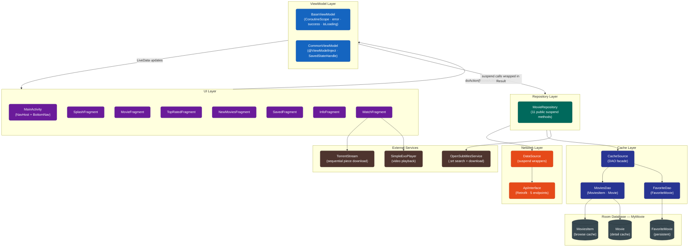
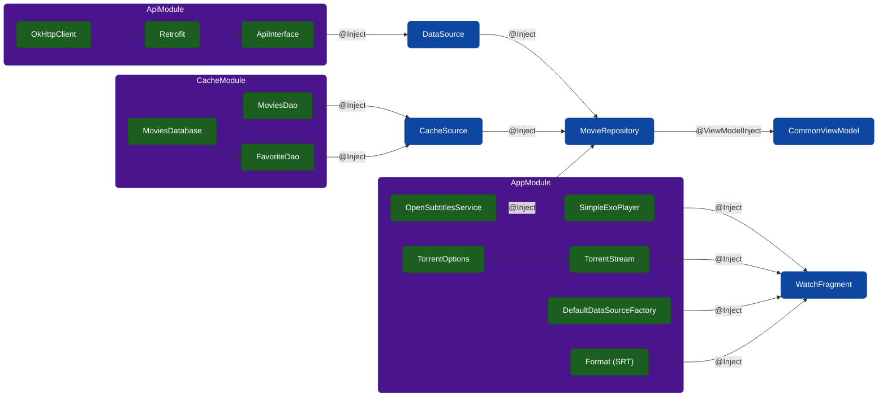
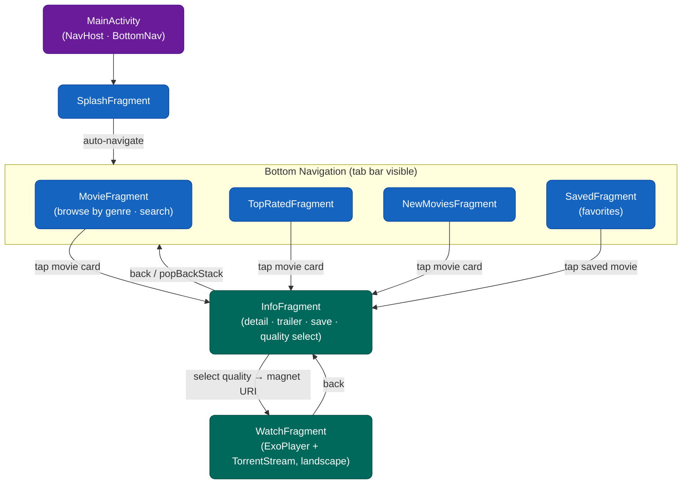
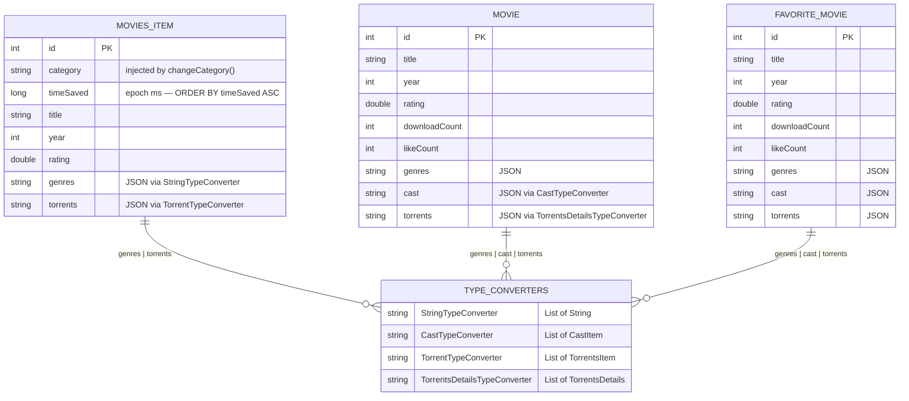

# MyMovies


**MyMovies** is a Kotlin Android client for discovering, streaming, and downloading movies from a third-party movie catalog API. It includes local subtitle search via OpenSubtitles, an offline favorites list, and torrent-based playback through ExoPlayer.

Rather than binding a `RecyclerView` directly to a Retrofit callback, this app treats the network response as *disposable* and the local Room cache as the *source of truth* for everything the UI renders.

---

## Table of Contents

1. [Problem Space](#1-problem-space)
2. [System Architecture](#2-system-architecture)
3. [Design Decisions & Rationale](#3-design-decisions--rationale)
   - [3.1 Cache-as-Source-of-Truth](#31-cache-as-source-of-truth)
   - [3.2 The `Result<T>` Sealed Wrapper](#32-the-resultt-sealed-wrapper)
   - [3.3 Torrent Playback: Magnet URI to ExoPlayer Frame](#33-torrent-playback-magnet-uri-to-exoplayer-frame)
   - [3.4 Subtitle Retrieval as a Second, Independent Client](#34-subtitle-retrieval-as-a-second-independent-client)
   - [3.5 Single-Activity Navigation](#35-single-activity-navigation)
4. [Module & File Reference](#4-module--file-reference)
5. [Data Models](#5-data-models)
6. [API Contract](#6-api-contract)
7. [Database Schema](#7-database-schema)
8. [ViewModel & Action System](#8-viewmodel--action-system)
9. [Tech Stack](#9-tech-stack)
10. [Getting Started](#10-getting-started)
11. [Known Rough Edges & Roadmap](#11-known-rough-edges--roadmap)
12. [Community & Project Health](#12-community--project-health)

---

## 1. Problem Space

A movie catalog/torrent client has three properties that rule out "call the API, bind a RecyclerView" as an architecture:

1. **The upstream API is a public, rate-limited, occasionally-flaky third-party service.** Every list view needs a resilience layer, not a direct pass-through.
2. **Playback is not "download then play."** A magnet link has no bytes at request time; ExoPlayer needs a readable stream, and TorrentStream sequentially fetches pieces via callbacks.
3. **Subtitles come from a different provider than the video** (OpenSubtitles, via a bespoke `OpenSubtitlesService`), making subtitle fetch an independent second client, not an extension of the movie API.

Every top-level decision below — the Room cache boundary, the `Result<T>` wrapper, the `DataSource`/`CacheSource` split, the `MovieRepository` fan-out — exists to answer one of these three problems.

---

## 2. System Architecture

The app is structured in four strict layers. Data moves upward through `LiveData`; commands move downward through `MovieAction`.



**DI backbone:** [`AppModule`](app/src/main/java/com/example/mymovies/di/AppModule.kt) provides app-level singletons (`SimpleExoPlayer`, `TorrentStream`, `DefaultDataSourceFactory`, `OpenSubtitlesService`), while `ApiModule` and `CacheModule` provide the network and persistence stacks respectively. Three Hilt modules feed every singleton into the layers above:



---

## 3. Design Decisions & Rationale

### 3.1 Cache-as-Source-of-Truth

The naive pattern — network call fills a list, list renders directly — is deliberately absent. [`fetchTypeMovies`](app/src/main/java/com/example/mymovies/repository/MovieRepository.kt) does this instead:

```kotlin
suspend fun fetchTypeMovies(type: String, page: Int): Result<List<MoviesItem>> = try {
    getNetworkCategory(type, page)                                       // 1. refill cache from network
    val result = cacheSource.getCacheMoviesList(type, 20, page.times(10)) // 2. read from Room
    if (result.isEmpty()) throw IllegalArgumentException()
    Result.build { result }
} catch (e: Exception) {
    throw e
}
```

The Fragment never sees the raw network shape for browse lists — only whatever Room returns, paginated with `limit`/`offset` semantics independent of the API's own pagination. This buys:

- **Decoupling of UI pagination from API pagination** — if the API changes page size, `MoviesDao` is untouched.
- **A natural stale-cache invalidation point** — `deleteLastCache()` clears `MoviesItem` once per cold session (guarded by a `firstLoad` flag).
- **Graceful degradation** — `fetchTopRatedMovies` falls back to `getCacheRanking(page)` when the network result is empty.

`fetchMovieDetails` has its own, simpler cache path (check Room first, fall back to network + save):

```kotlin
suspend fun fetchMovieDetails(id: Int): Result<Movie> = try {
    var result: Movie? = cacheSource.getSpecificMovie(id)
    if (result == null) result = getNetworkDetails(id)
    Result.build { result }
} catch (e: Exception) {
    throw e
}
```

Once a detail page has been opened, reopening it costs zero network requests.

### 3.2 The `Result<T>` Sealed Wrapper

[`Result`](app/src/main/java/com/example/mymovies/models/Result.kt) is a sealed class with five variants:

```kotlin
sealed class Result<out V> {
    class Loading<out V> : Result<V>()
    data class Success<out V>(val data: V) : Result<V>()
    data class Failure<out V>(val throwable: Throwable) : Result<V>()
    data class Value<out V>(val value: V) : Result<V>()
    data class Error(val exception: Exception) : Result<Nothing>()

    companion object {
        inline fun <V> build(function: () -> V): Result<V> = try {
            Value(function.invoke())
        } catch (e: Exception) {
            Error(e)
        }
    }
}
```

Every repository method returns `Result<T>`, not `T` and not a raw exception, keeping `try/catch` out of the ViewModel. `CommonViewModel` currently unwraps only the `Value` branch:

```kotlin
is MovieAction.FetchTypeMovies -> fetchTypeMovies(action.type, action.page)
// ...
is Result.Value -> mutableListTypeMovies.postValue(result.value!!)
```

`Loading`, `Success`, `Failure`, and `Error` are reserved for future use.

### 3.3 Torrent Playback: Magnet URI to ExoPlayer Frame

[`WatchFragment`](app/src/main/java/com/example/mymovies/views/fragments/WatchFragment.kt) bridges two systems never designed to talk to each other:

- **TorrentStream** operates on *pieces* — it downloads sequentially, prioritizing playback-critical pieces, and exposes `TorrentListener` callbacks (`onStreamPrepared`, etc.).
- **ExoPlayer** operates on *files/streams* — it expects something seekable, not a piece-completion callback.

`InfoFragment.generateMagneticUrl()` builds the magnet URI from the torrent hash, movie name, and year, plus eight tracker URLs. Once TorrentStream reports the stream is ready, the resulting file is handed to ExoPlayer.

`TorrentOptions` configured in `AppModule`:

```kotlin
TorrentOptions.Builder()
    .removeFilesAfterStop(true)
    .saveLocation(Environment.getExternalStoragePublicDirectory(Environment.DIRECTORY_DOWNLOADS))
    .build()
```

`removeFilesAfterStop(true)` prevents the Downloads folder from accumulating partial videos. Subtitles are merged in via `MergingMediaSource`:

```kotlin
// Without subtitle:
mergeMediaSource = MergingMediaSource(mediaSource)

// After subtitle download:
val textMediaSource = SingleSampleMediaSource.Factory(factory)
    .createMediaSource(data, format, C.TIME_UNSET)
mergeMediaSource = MergingMediaSource(mediaSource, textMediaSource)
simplePlayer.addingSubtitle(mergeMediaSource, simplePlayer.currentPosition)
```

`WatchFragment` forces landscape on creation, restores `SCREEN_ORIENTATION_FULL_SENSOR` on destroy, and suspends/resumes both the torrent session and the player symmetrically across `onPause`/`onResume`/`onDestroyView`.

### 3.4 Subtitle Retrieval as a Second, Independent Client

`fetchMovieSubTitle` and `downloadMovieSubTitle` live on `MovieRepository` alongside the movie-catalog methods but talk to a completely different backend (`OpenSubtitlesService`):

```kotlin
// Search
subtitleService.search(OpenSubtitlesService.TemporaryUserAgent, url)
// url built by: OpenSubtitlesUrlBuilder().query(movieName).build()

// Download
subtitleService.downloadSubtitle(context, subtitle, filePath)
// filePath: Uri.fromFile(File("${activity?.getExternalFilesDir(null)?.absolutePath}/${subtitle.SubFileName}"))
```

End-to-end flow from tap to active subtitle track:

```mermaid
sequenceDiagram
    autonumber
    participant WF as WatchFragment
    participant CV as CommonViewModel
    participant MR as MovieRepository
    participant OSS as OpenSubtitlesService
    participant EXT as External Files Dir

    note over WF: User taps subtitle button during playback
    WF->>WF: simplePlayer.stopPlayer()
    WF->>CV: doAction(FetchMovieSubTitle(movieName))

    rect rgb(78, 52, 46)
        CV->>MR: fetchMovieSubTitle(agent, url)
        MR->>OSS: search(TemporaryUserAgent, url)
        OSS-->>MR: Array<OpenSubtitleItem>
        MR-->>CV: Result.Value(subtitles)
    end

    CV-->>WF: subtitleData LiveData fires
    WF->>WF: showMovieSubtitlesDialog(subtitles)

    note over WF: User selects a subtitle

    rect rgb(40, 53, 147)
        WF->>CV: doAction(DownloadMovieSubTitle(context, subtitle, filePath))
        CV->>MR: downloadMovieSubTitle(context, subtitle, filePath)
        MR->>OSS: downloadSubtitle(context, subtitle, filePath)
        OSS-->>EXT: writes .srt file
        MR-->>CV: Result.Value("Success")
        CV-->>WF: subtitleStatus LiveData fires
    end

    WF->>WF: addSubtitleToPlayer(filePath)
    note over WF: MergingMediaSource(videoSource, textSource)\nPlayer resumes at same position with subtitle active
```



Keeping subtitle methods on `MovieRepository` (instead of a separate `SubtitleRepository`) was a deliberate simplification: "get me artifacts related to this movie" is one conceptual operation from the ViewModel's perspective.

### 3.5 Single-Activity Navigation

The app has a single `Activity`; all screens are `Fragment`s under the Navigation Component. The bottom nav is shown/hidden reactively based on destination:

```kotlin
when (destination.id) {
    R.id.splashFragment, R.id.watchFragment, R.id.infoFragment -> binding.bottomNav.toGone()
    else -> binding.bottomNav.toVisible()
}
```



Back-press is intercepted for `MovieFragment` (scrolls to top instead of exiting, if scrolled past row 10) and `InfoFragment` (collapses YouTube fullscreen before popping). `InfoFragment` uses a shared element transition (`android.R.transition.move`, `transitionName = "transition"`) on the movie cover. `BaseActivity`/`BaseViewModel` hoist the `error`/`success`/`isLoading` LiveData and `doAction(action: Action)` contract shared by every screen.

---

## 4. Module & File Reference

### api
| File | Role |
|---|---|
| [`ApiInterface.kt`](app/src/main/java/com/example/mymovies/api/ApiInterface.kt) | Retrofit interface: `searchMovie`, `getMoviesByCategory`, `getMovieDetails`, `getMoviesByRank`, `getMoviesByDate` |
| [`ApiModule.kt`](app/src/main/java/com/example/mymovies/api/ApiModule.kt) | Hilt module: OkHttp (logging interceptor), Retrofit, `ApiInterface` |
| [`DataSource.kt`](app/src/main/java/com/example/mymovies/api/DataSource.kt) | Thin `@Inject` wrapper over `ApiInterface`, exposes `suspend` methods |
| [`Routes.kt`](app/src/main/java/com/example/mymovies/api/Routes.kt) | Endpoint path constants |

### cache
| File | Role |
|---|---|
| [`MoviesDatabase.kt`](app/src/main/java/com/example/mymovies/cache/MoviesDatabase.kt) | Room DB v1: `MoviesItem`, `Movie`, `FavoriteMovie` entities + type converters |
| [`MoviesDao.kt`](app/src/main/java/com/example/mymovies/cache/MoviesDao.kt) | DAO for `MoviesItem`/`Movie`: save, paginated get, delete |
| [`FavoriteDao.kt`](app/src/main/java/com/example/mymovies/cache/FavoriteDao.kt) | DAO for `FavoriteMovie`: save/get/delete/exists |
| [`CacheSource.kt`](app/src/main/java/com/example/mymovies/cache/CacheSource.kt) | `@Inject` facade over both DAOs |
| [`CacheModule.kt`](app/src/main/java/com/example/mymovies/cache/CacheModule.kt) | Hilt module providing `MoviesDatabase` and DAOs |

### di
| File | Role |
|---|---|
| [`AppModule.kt`](app/src/main/java/com/example/mymovies/di/AppModule.kt) | App-scoped singletons: `OpenSubtitlesService`, `SimpleExoPlayer`, `DefaultDataSourceFactory`, `TorrentOptions`, `TorrentStream` |

### models
| File | Role |
|---|---|
| [`Result.kt`](app/src/main/java/com/example/mymovies/models/Result.kt) | Sealed wrapper (§3.2) |
| [`MovieDetails.kt`](app/src/main/java/com/example/mymovies/models/MovieDetails.kt) | Detail API response wrapper: `Movie`, `CastItem`, `TorrentsDetails` |
| [`FavoriteMovie.kt`](app/src/main/java/com/example/mymovies/models/FavoriteMovie.kt) | Room entity for persisted favorites |
| [`TypeConverters.kt`](app/src/main/java/com/example/mymovies/models/TypeConverters.kt) | Room converters for genre/cast/torrent lists |
| [`response/MoviesResponse.kt`](app/src/main/java/com/example/mymovies/models/response/MoviesResponse.kt) | API response envelope for list endpoints |

### repository
| File | Role |
|---|---|
| [`MovieRepository.kt`](app/src/main/java/com/example/mymovies/repository/MovieRepository.kt) | Single fan-out point: 11 public `suspend` methods, 3 private network helpers |

### utils
| File | Role |
|---|---|
| [`UtilTypeConverter.kt`](app/src/main/java/com/example/mymovies/utils/UtilTypeConverter.kt) | Extension functions: view visibility, bottom-nav toggles, ExoPlayer helpers |
| [`ViewUtil.kt`](app/src/main/java/com/example/mymovies/utils/ViewUtil.kt) | Additional view utilities |
| [`constants/Constants.kt`](app/src/main/java/com/example/mymovies/utils/constants/Constants.kt) | `BASE_URL`, `DB_NAME`, `YOUTUBE_API_KEY`, genre list |

### viewmodels
| File | Role |
|---|---|
| [`BaseViewModel.kt`](app/src/main/java/com/example/mymovies/viewmodels/BaseViewModel.kt) | Abstract `ViewModel` + `CoroutineScope`, exposes `error`/`success`/`isLoading` |
| [`CommonViewModel.kt`](app/src/main/java/com/example/mymovies/viewmodels/CommonViewModel.kt) | `@ViewModelInject`; exposes movie/subtitle LiveData; dispatches `MovieAction` |
| [`TemplateViewModel.kt`](app/src/main/java/com/example/mymovies/viewmodels/TemplateViewModel.kt) | Scaffold for new screens |
| [`actions/MovieAction.kt`](app/src/main/java/com/example/mymovies/viewmodels/actions/MovieAction.kt) | Sealed action class, 11 variants (§8) |

### views
**Activities:** [`BaseActivity.kt`](app/src/main/java/com/example/mymovies/views/activities/BaseActivity.kt) (stub), [`MainActivity.kt`](app/src/main/java/com/example/mymovies/views/activities/MainActivity.kt) (`@AndroidEntryPoint`, hosts `NavHostFragment`, wires bottom nav)

**Fragments**
| Fragment | Screen | Key Responsibilities |
|---|---|---|
| `SplashFragment` | Launch | Initial splash before navigating to `MovieFragment` |
| `MovieFragment` | Browse | Genre chip list, paginated grid, search |
| `TopRatedFragment` | Top-rated | Sorted by rating, Room fallback |
| `NewMoviesFragment` | Recently added | Sorted by date added |
| `SavedFragment` | Favorites | Reads `FavoriteMovie` table |
| `InfoFragment` | Detail | Cover, genres, cast, screenshots, save, quality select |
| `WatchFragment` | Playback | TorrentListener + Player.EventListener, forced landscape |
| `TemplateFragment` | Scaffold | Empty template |

**Adapters:** `ItemMovieAdapter`, `ItemMovieTypeAdapter`, `ItemTopRatedAdapter`, `ItemSavedAdapter`, `ItemCastAdapter`, `ItemScreenShotAdapter`, `ItemSubtitleAdapter`, `ItemQualityAdapter`, `TemplateAdapter`

---

## 5. Data Models

- **Movie** (full detail, Room entity) — `id` (PK), `title`, `titleEnglish`, `titleLong`, `slug`, `year`, `rating`, `runtime`, `language`, `mpaRating`, `imdbCode`, `descriptionFull`, `descriptionIntro`, `summary`, `url`, `ytTrailerCode`, screenshots, cast, torrents, `downloadCount`, `likeCount`.
- **MoviesItem** (browse cache, Room entity) — subset of `Movie` used for list display.
- **FavoriteMovie** (Room entity) — same as `Movie` minus unused fields; populated via `Movie.convertToFavorite()`.
- **CastItem** — `name`, `characterName`, `urlSmallImage`, `imdbCode`.
- **TorrentsDetails / TorrentsItem** — `hash`, `quality`, `type`, `url`, `size`, `sizeBytes`, `seeds`, `peers`, `dateUploaded`, `dateUploadedUnix`. The `hash` feeds `InfoFragment.generateMagneticUrl()`.

---

## 6. API Contract

Base URL is set in [`Constants.kt`](app/src/main/java/com/example/mymovies/utils/constants/Constants.kt). Endpoints are path constants in [`Routes.kt`](app/src/main/java/com/example/mymovies/api/Routes.kt):

| Constant | Path | Notes |
|---|---|---|
| `LIST_MOVIES` | `list_movies.json` | Category, search, rank, new-movies queries |
| `MOVIE_DETAILS` | `movie_details.json` | Full `Movie` with images and cast |
| `MOVIE_SUGGESTIONS` | `movie_suggestions.json` | Defined, not yet wired |
| `MOVIE_COMMENTS` | `movie_comments.json` | Defined, not yet wired |
| `MOVIE_REVIEW` | `movie_reviews.json` | Defined, not yet wired |
| `MOVIE_PARENTAL_GUIDE` | `movie_parental_guides.json` | Defined, not yet wired |
| `UPCOMING_MOVIES` | `list_upcoming.json` | Defined, not yet wired |
| `USER_DETAILS` | `user_details.json` | Defined, not yet wired |

**Active `ApiInterface` methods:**

| Method | Query params | Sort/filter baked in |
|---|---|---|
| `searchMovie(search, page)` | `query_term`, `page` | `sort_by=download_count`, `order_by=desc`, `limit=50` |
| `getMoviesByCategory(category, page)` | `genre`, `page` | `sort_by=download_count`, `order_by=desc`, `limit=50` |
| `getMovieDetails(id)` | `movie_id` | `with_images=true`, `with_cast=true`, `limit=50` |
| `getMoviesByRank(page)` | `page` | `sort_by=rating`, `limit=50` |
| `getMoviesByDate(page)` | `page` | `sort_by=date_added`, `order_by=desc`, `limit=50` |

---

## 7. Database Schema

Three Room entities in one database. `MoviesItem`/`Movie` are separate caches; `FavoriteMovie` is persistent.



*(Full column lists for each entity mirror the fields in §5; JSON-encoded columns use the converters listed above.)*

**Database name:** `MyMovie` · **Version:** 1 · `exportSchema = false`

Key queries:

```sql
-- Browse (category + pagination)
SELECT * FROM MoviesItem WHERE category = :category ORDER BY timeSaved ASC LIMIT :limit OFFSET :page

-- Top-rated fallback
SELECT * FROM MoviesItem ORDER BY rating DESC LIMIT :limit OFFSET :page

-- Full clear (once per cold session)
DELETE FROM MoviesItem

-- Detail cache lookup
SELECT * FROM movie WHERE id = :id LIMIT 1

-- Favorites (REPLACE on conflict — re-saving is idempotent)
SELECT * FROM FavoriteMovie
DELETE FROM FavoriteMovie WHERE id = :id
SELECT EXISTS(SELECT * FROM FavoriteMovie WHERE id = :id)  -- heart icon state
```

---

## 8. ViewModel & Action System

`BaseViewModel<Action>` is a generic abstract `ViewModel` that also implements `CoroutineScope`, binding coroutines to `Dispatchers.IO` with a fresh `Job()`. It exposes `error`, `success`, and `isLoading` `LiveData`, plus the `doAction(action: Action)` contract every subclass implements.

`CommonViewModel` is the single ViewModel shared across all active Fragments via `ViewModelProvider(requireActivity())`. It dispatches `MovieAction` and exposes results as `LiveData`: `listTypeMovies`, `moviesResponse`, `movieDetails`, `listTopRatedMovies`, `listSavedMovie`, `isSaved`, `subtitleData`, `subtitleStatus`.

```kotlin
sealed class MovieAction {
    data class FetchTypeMovies(val type: String, val page: Int = 1) : MovieAction()
    data class FetchQueryMovies(val query: String, val page: Int) : MovieAction()
    data class FetchMovieDetails(val id: Int) : MovieAction()
    data class FetchTopRatedMovies(val page: Int) : MovieAction()
    data class FetchNewMovies(val page: Int) : MovieAction()
    data class SaveMovie(val movie: Movie) : MovieAction()
    object FetchSavedMovies : MovieAction()
    data class DeleteSavedMovie(val id: Int) : MovieAction()
    data class CheckSavedMovie(val id: Int) : MovieAction()
    data class FetchMovieSubTitle(val movieName: String) : MovieAction()
    data class DownloadMovieSubTitle(val context: Context, val subtitle: OpenSubtitleItem, val filePath: Uri) : MovieAction()
}
```

`TemplateViewModel`/`TemplateFragment`/`TemplateAdapter` are an intentionally empty scaffold for adding new screens without re-deriving the ViewModel/Action boilerplate.

---

## 9. Tech Stack

| Layer | Technology |
|---|---|
| Language | Kotlin (97.2%), Java (2.8%) |
| DI | Hilt |
| Local storage | Room |
| Networking | Retrofit + OkHttp (logging interceptor) + Gson |
| Playback | ExoPlayer (`SimpleExoPlayer`) + TorrentStream |
| Subtitles | OpenSubtitles (bespoke `OpenSubtitlesService`) |
| Navigation | Jetpack Navigation Component, single-Activity |
| Async | Kotlin Coroutines |

---

## 10. Getting Started

```bash
git clone https://github.com/PRADEEPERIYASAMY/MyMovies.git
cd MyMovies
./gradlew assembleDebug
```

Requires:
- Android Studio (recent stable)
- minSdk 23 / targetSdk 30
- A valid `YOUTUBE_API_KEY` in [`Constants.kt`](app/src/main/java/com/example/mymovies/utils/constants/Constants.kt) if you want trailer playback to work

---

## 11. Known Rough Edges & Roadmap

- `NewMoviesFragment` currently bypasses the Room round-trip used elsewhere — inconsistent with the cache-as-source-of-truth pattern in §3.1.
- Several `Routes.kt` endpoints (`MOVIE_SUGGESTIONS`, `MOVIE_COMMENTS`, `MOVIE_REVIEW`, `MOVIE_PARENTAL_GUIDE`, `UPCOMING_MOVIES`, `USER_DETAILS`) are defined but not yet wired to any UI.
- `Result<T>`'s `Loading`/`Success`/`Failure` variants are defined but unused — only `Value`/`Error` are consumed today.
- `TemplateFragment`/`TemplateViewModel`/`TemplateAdapter` are placeholders for future screens.

---

## 12. Community & Project Health

- [Contributing Guide](CONTRIBUTING.md)
- [Code of Conduct](CODE_OF_CONDUCT.md)
- [Security Policy](SECURITY.md)
- [Support](SUPPORT.md)
- [Acknowledgements](ACKNOWLEDGEMENTS.md)
- [License (MIT)](LICENSE)
